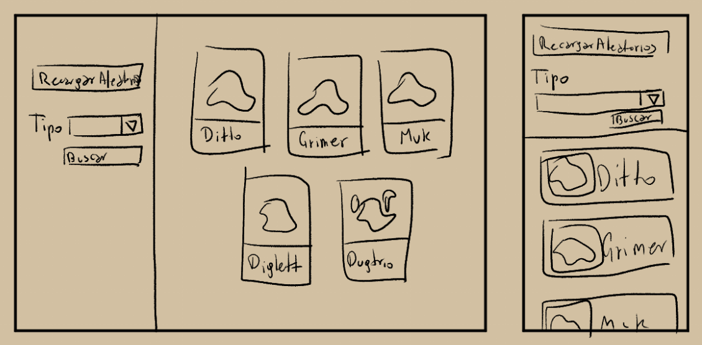
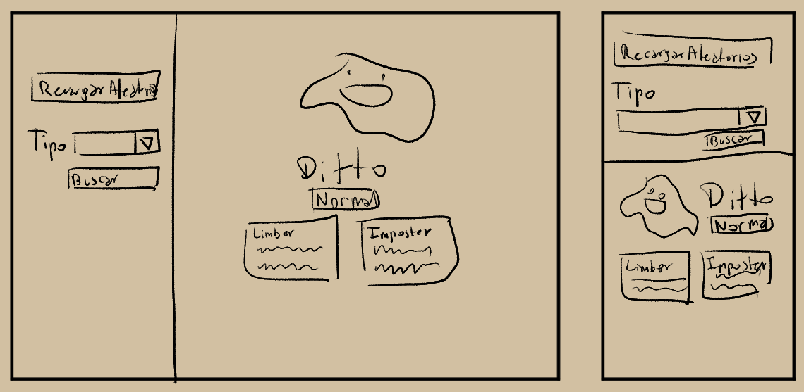

# Pokedex Tech Test

## Requerimientos
- Ver 5 Pokémon aleatorios y refrescar para mostrar nuevos.
- Buscar Pokémon por tipo.
- Ver Pokémon en detalle al hacerle click.
  - También debería poder seleccionar el idioma entre una lista de idioma.
- Responsive.
- Test unitarios en las funciones de Pokémon aleatorios, búsqueda por tipo y visualización de detalles

## Decisiones de Diseño

Se usa Jest para la suit de testing, guardándola como una dependencia de desarrollo.

```
npm install jest --save-dev
```

### Interfaz

#### Vista de Búsqueda



#### Vista de Visualización Específica




# Configuración del Proyecto 

## Instalación de Dependencias
```
npm install
```

### Ejecutar Entorno de Desarrollo
```
npm run serve
```

### Compilado Para Producción
```
npm run build
```
